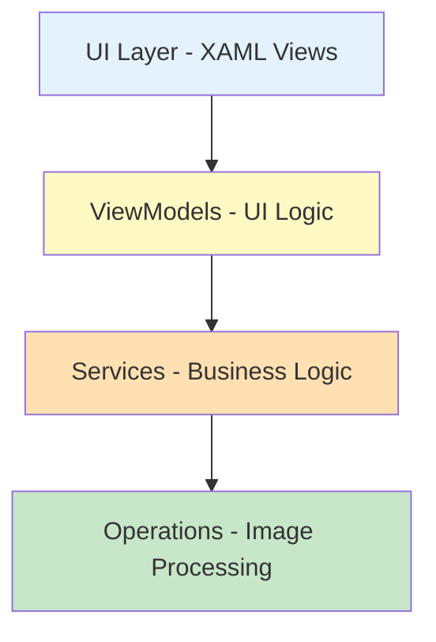
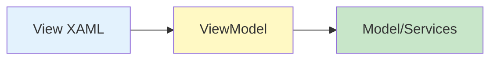

# Architecture Documentation

## Table of Contents

1. [System Overview](#system-overview)
2. [Application Structure](#application-structure)
3. [Key Components](#key-components)
4. [How It Works](#how-it-works)

---

## System Overview

The application follows a simple layered architecture:



**Tech Stack:**
- .NET 10 + C# 12
- WPF for Windows UI
- MVVM pattern for clean separation
- Dependency Injection for loose coupling

---

## Application Structure

### Project Organization

```
ImageReviewerApp/
├── Commands/          # Button actions (Load, Save, Apply)
├── Contracts/         # Interfaces for services
├── Models/            # Data classes (ImageData, Metadata)
├── Operations/        # Image processing algorithms
├── Services/          # File operations, dialogs
├── ViewModels/        # UI logic and state
├── Views/             # XAML UI files
└── App.xaml          # Application startup
```

### Main Classes

**Models** - Hold data
- `ImageData` - Stores pixel data and dimensions
- `ImageMetadata` - Stores image info (width, height, etc.)
- `ImageStatistics` - Calculates min, max, mean values

**ViewModels** - Handle UI logic
- `MainViewModel` - Main window logic
- Parameter ViewModels - Controls for each operation

**Services** - Do the work
- `ImageLoaderService` - Loads TIFF files
- `ImageSaveService` - Saves processed images
- `ImageOperationFactory` - Creates operations

**Operations** - Process images
- `WindowLevelOperation`
- `GammaCorrectionOperation`
- `GaussianFilterOperation`
- `MedianFilterOperation`
- `ThresholdingOperation`
- `BadPixelSuppressionOperation`

---

## Key Components

### 1. MVVM Pattern




- **View** - UI markup (MainWindow.xaml)
- **ViewModel** - UI logic (MainViewModel.cs)
- **Model** - Data and business logic

### 2. Dependency Injection

Services are registered at startup and injected where needed:

```csharp
// In App.xaml.cs
services.AddSingleton<IImageLoaderService, ImageLoaderService>();
services.AddSingleton<IImageSaveService, ImageSaveService>();
services.AddTransient<MainViewModel>();
```

### 3. Strategy Pattern for Operations

All operations implement the same interface:

```csharp
public interface IImageOperation
{
    string Name { get; }
    ImageData Execute(ImageData image, IProgress<double> progress, CancellationToken ct);
}
```

This makes it easy to add new operations without changing existing code.

---

## How It Works

### Loading an Image

1. User clicks "Load Image"
2. Dialog opens to select file
3. `ImageLoaderService` reads the TIFF file
4. Converts to `ImageData` object
5. Calculates statistics (min, max, mean)
6. Displays in UI

### Applying an Operation

1. User selects operation from dropdown
2. Parameter controls appear
3. User adjusts sliders
4. Clicks "Apply"
5. Operation processes image in background
6. Progress bar updates
7. Result displays on right side

### Saving an Image

1. User clicks "Save Image"
2. Save dialog opens
3. `ImageSaveService` writes TIFF file
4. Success message shown

---

## Design Decisions

### Why MVVM?
- Separates UI from logic
- Makes code testable
- Standard pattern for WPF

### Why Dependency Injection?
- Easy to mock services in tests
- Loose coupling between components
- Easier to maintain

### Why Async/Await?
- UI stays responsive
- Can cancel long operations
- Better user experience

### Why Strategy Pattern?
- Easy to add new operations
- Each operation is independent
- Clean, maintainable code

---

## Adding a New Operation

Simple steps to extend the application:

1. Create new class implementing `IImageOperation`
2. Add to `ImageOperation` enum
3. Register in `ImageOperationFactory`
4. Create parameter ViewModel (if needed)
5. Add UI template for parameters
6. Write tests

Example:
```csharp
public class MyNewOperation : IImageOperation
{
    public string Name => "My Operation";

    public ImageData Execute(ImageData image, IProgress<double> progress, CancellationToken ct)
    {
        // Your processing code here
        return processedImage;
    }
}
```

---

## Performance Approach

- **Async operations** - Don't block UI
- **Progress reporting** - Keep user informed
- **Cancellation support** - Let user stop if needed
- **LUT optimization** - Pre-compute values for speed
- **Memory<T>** - Efficient memory handling

---

## Testing Strategy

- **Unit tests** for operations and ViewModels
- **Mocking** services with Moq
- **85% code coverage** achieved
- **Fast tests** - No UI dependencies

---

## Folder Structure

```
src/
├── Commands/              # RelayCommand, AsyncRelayCommand
├── Contracts/             # IImageOperation, IImageLoaderService, etc.
├── Converters/            # XAML value converters
├── Enums/                 # ImageOperation enum
├── Extensions/            # Helper extensions
├── Factories/             # ImageOperationFactory
├── Models/                # ImageData, ImageMetadata
│   └── OperationParameters/  # Parameter classes
├── Operations/            # 6 image operations
├── Services/              # File I/O, dialogs
├── Styles/                # XAML styles and templates
├── Utilities/             # Helper utilities
├── ViewModels/            # MainViewModel and parameter VMs
│   └── OperationParameters/  # Parameter ViewModels
├── App.xaml              # Application entry point
└── MainWindow.xaml       # Main UI
```

---

## Summary

This is a straightforward WPF application using standard patterns:
- MVVM for clean separation
- Dependency Injection for flexibility
- Strategy pattern for operations
- Async/await for responsiveness

The architecture makes it easy to:
- Add new image operations
- Test components independently
- Maintain and extend code
- Understand how everything connects

**Author:** Anoopa Kedila  
**Version:** 1.0
