# ImageReviewer - Architecture Documentation

## Table of Contents

1. [High-Level Design (HLD)](#high-level-design-hld)
2. [Low-Level Design (LLD)](#low-level-design-lld)
3. [Class Diagrams](#class-diagrams)
4. [Sequence Diagrams](#sequence-diagrams)
5. [Component Architecture](#component-architecture)
6. [Data Flow Diagrams](#data-flow-diagrams)
7. [Deployment Architecture](#deployment-architecture)

---

## High-Level Design (HLD)

### System Architecture Overview

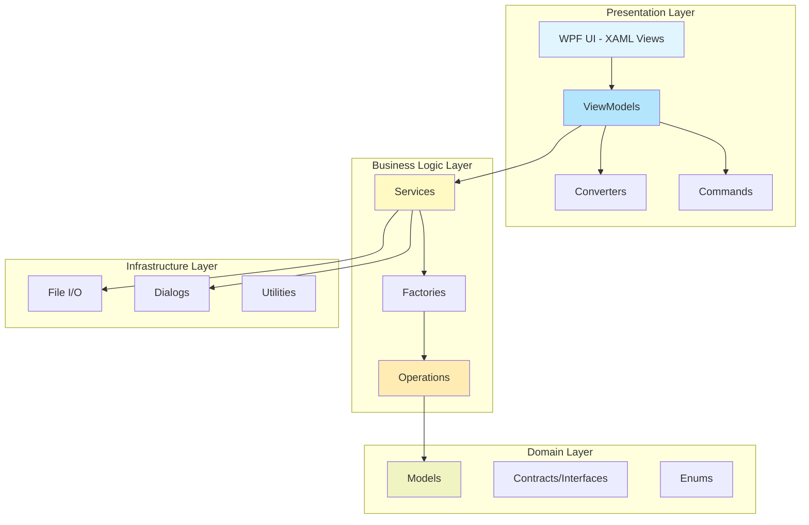

### Technology Stack

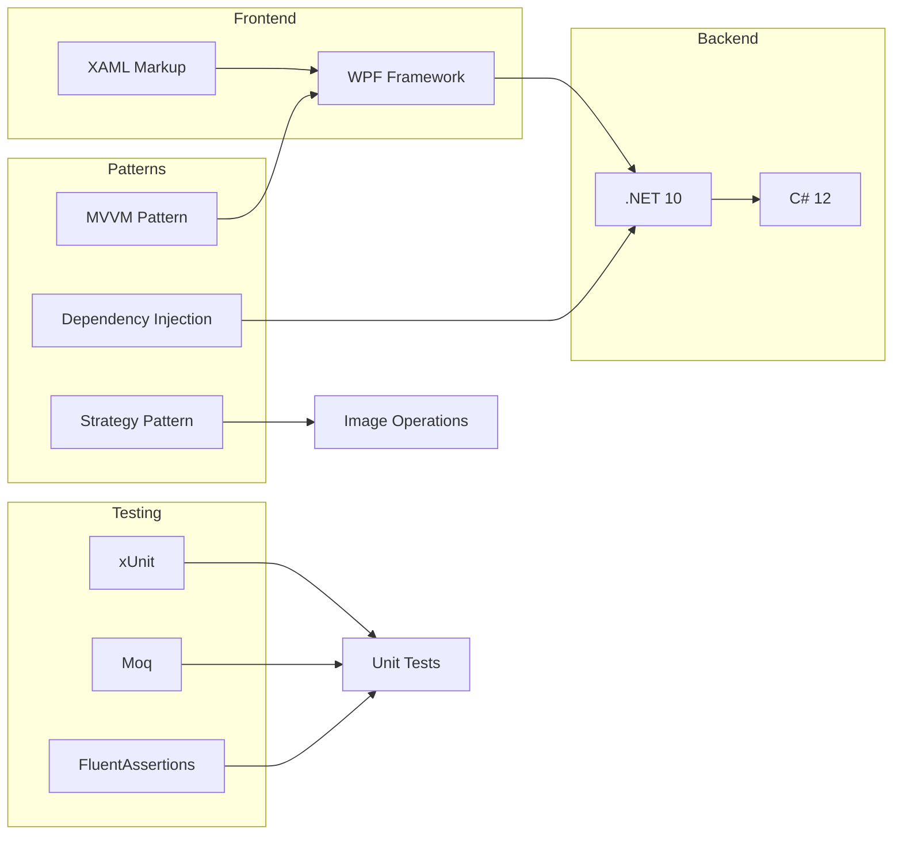

---

## Low-Level Design (LLD)

### MVVM Architecture Details

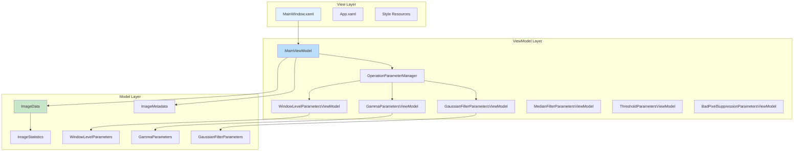

### Service Architecture

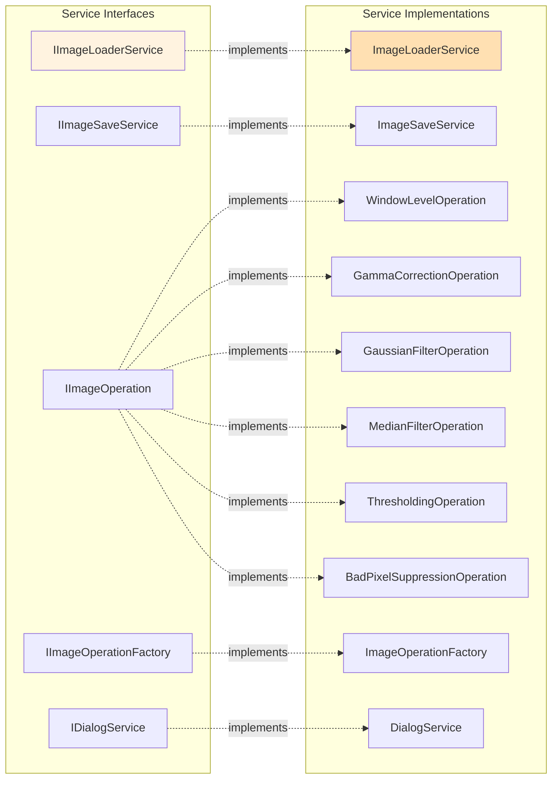

---

## Class Diagrams

### Core Domain Model

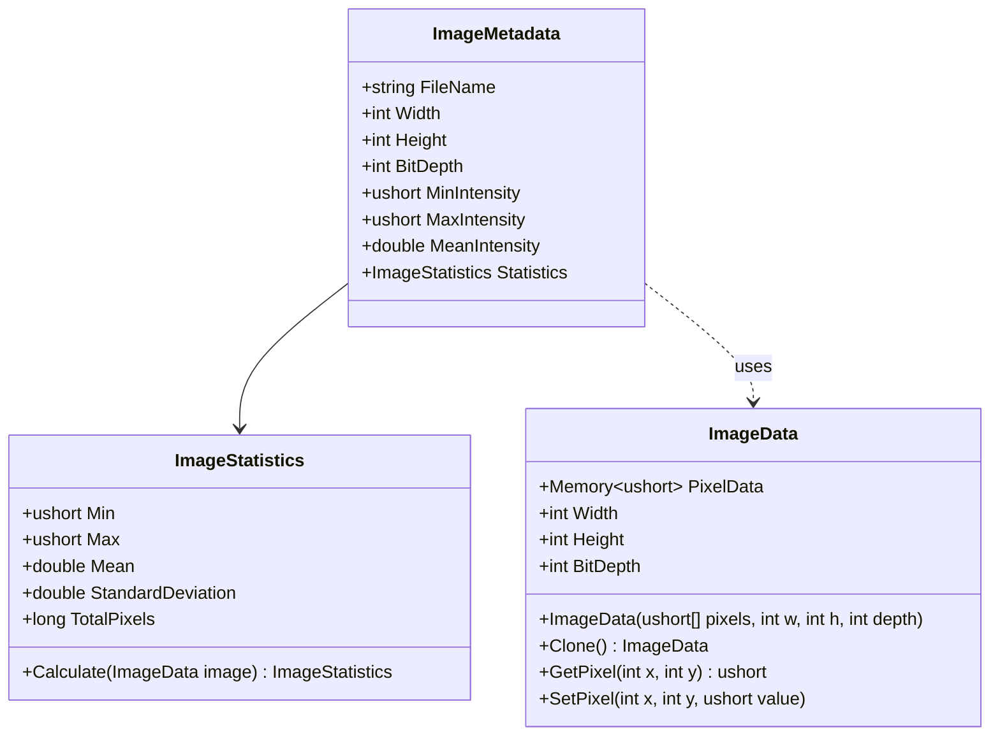

### ViewModel Hierarchy

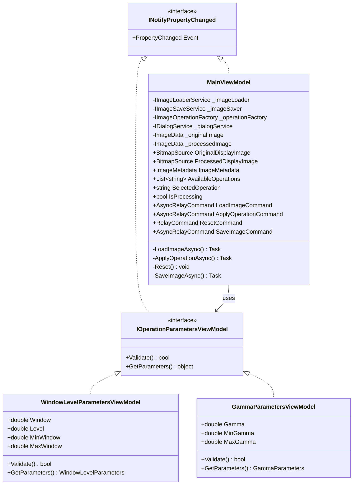

### Operation Strategy Pattern

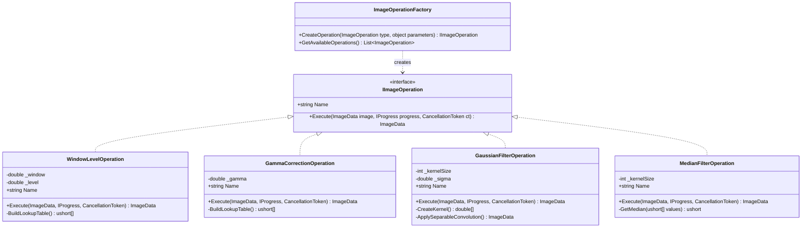

### Command Pattern Implementation

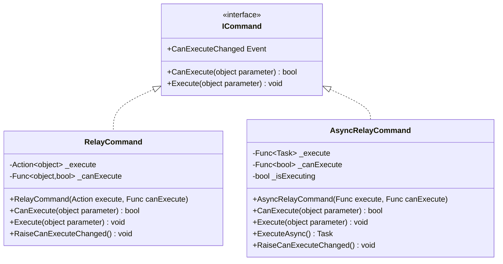

---

## Sequence Diagrams

### Load Image Workflow

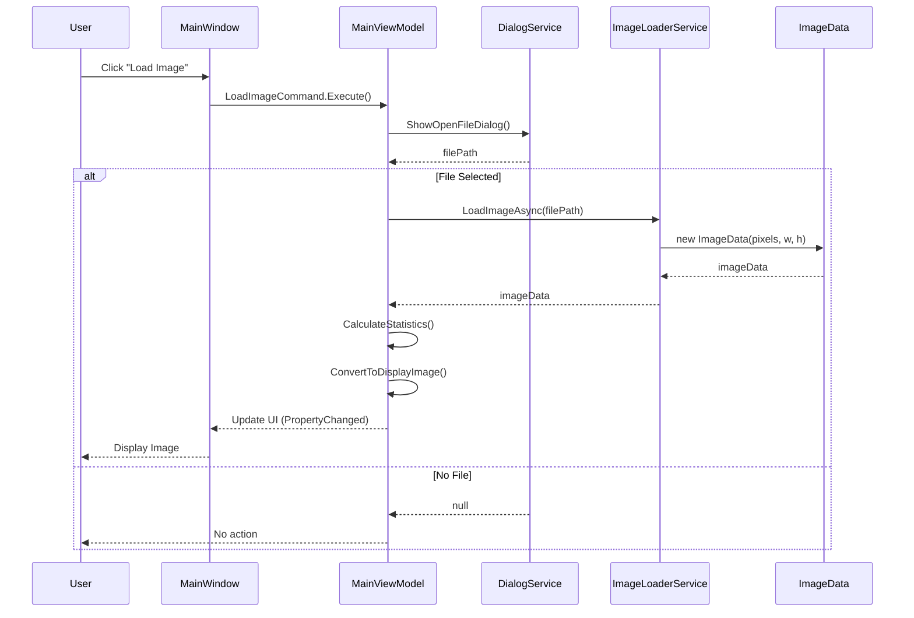

### Apply Operation Workflow

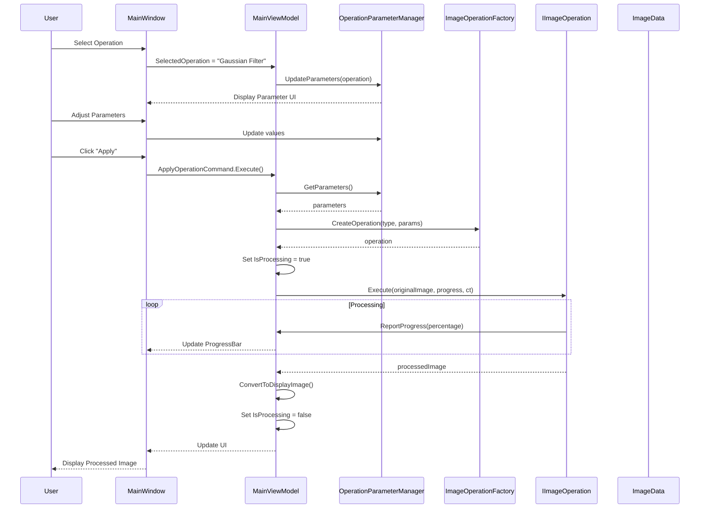

### Save Image Workflow

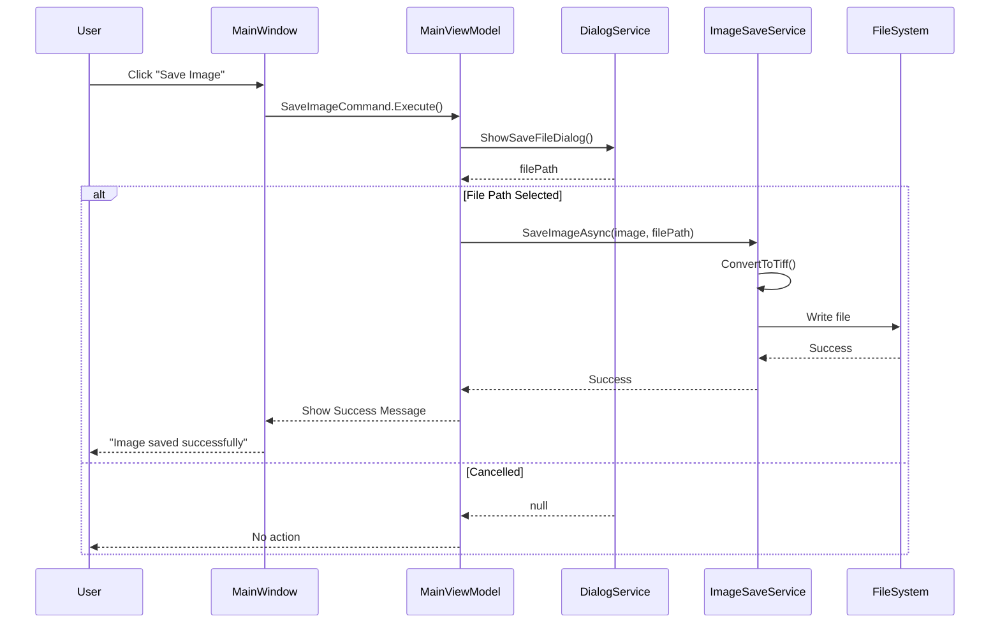

---

## Component Architecture

### Dependency Injection Container

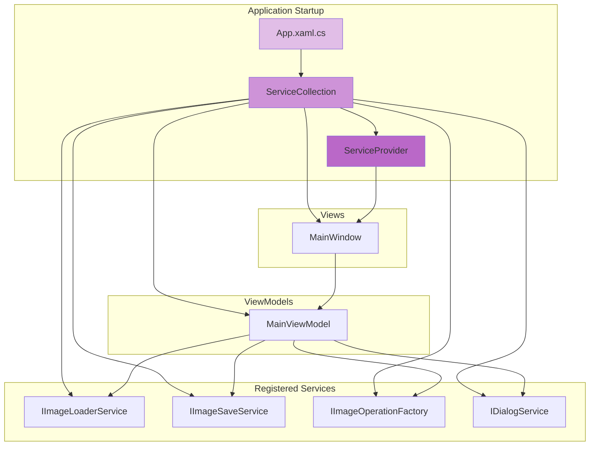

### Layer Dependencies

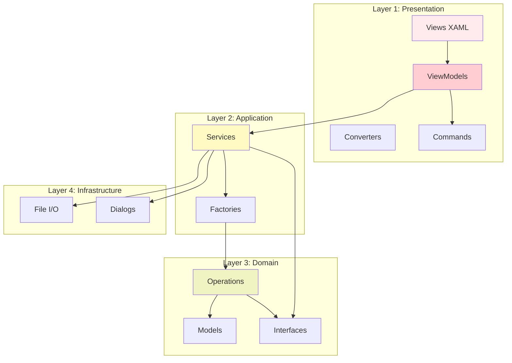

---

## Data Flow Diagrams

### Image Processing Pipeline

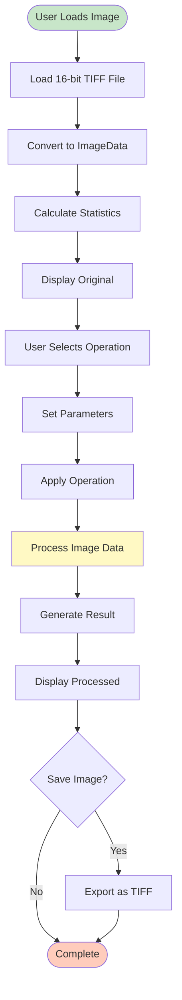

### Operation Execution Flow

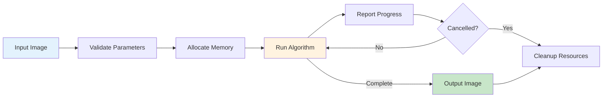

---

## Deployment Architecture

### Application Structure

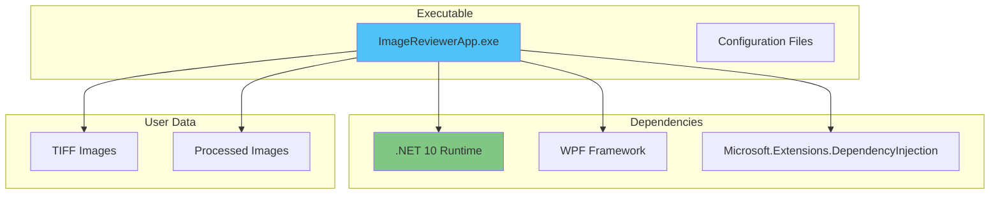

### Folder Structure

```
ImageReviewerApp/
├── bin/
│   ├── ImageReviewerApp.exe          ← Main Executable
│   ├── ImageReviewerApp.dll          ← Application DLL
│   ├── ImageReviewerApp.deps.json   ← Dependencies
│   ├── ImageReviewerApp.runtimeconfig.json
│   └── Microsoft.Extensions.*.dll    ← Runtime Dependencies
├── src/
│   ├── Commands/
│   ├── Contracts/
│   ├── Converters/
│   ├── Enums/
│   ├── Extensions/
│   ├── Factories/
│   ├── Models/
│   ├── Operations/
│   ├── Services/
│   ├── Styles/
│   ├── Utilities/
│   ├── ViewModels/
│   ├── App.xaml
│   └── MainWindow.xaml
├── Properties/
│   └── launchSettings.json
└── app.manifest
```

---

## Design Patterns Applied

### 1. Model-View-ViewModel (MVVM)

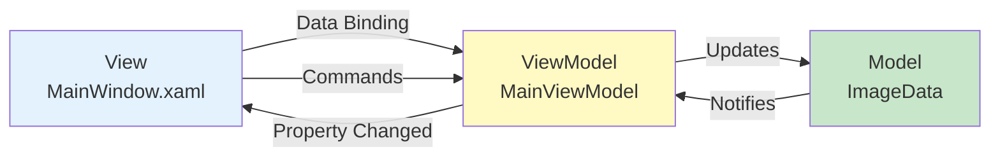

### 2. Strategy Pattern

```mermaid
graph TB
    CLIENT[Client<br/>MainViewModel]
    CONTEXT[Context<br/>IImageOperation]
    
    STRAT1[ConcreteStrategy<br/>WindowLevelOperation]
    STRAT2[ConcreteStrategy<br/>GammaCorrectionOperation]
    STRAT3[ConcreteStrategy<br/>GaussianFilterOperation]
    
    CLIENT --> CONTEXT
    CONTEXT <|.. STRAT1
    CONTEXT <|.. STRAT2
    CONTEXT <|.. STRAT3
    
    style CONTEXT fill:#fff3e0
    style STRAT1 fill:#e0f2f1
    style STRAT2 fill:#e0f2f1
    style STRAT3 fill:#e0f2f1
```

### 3. Factory Pattern

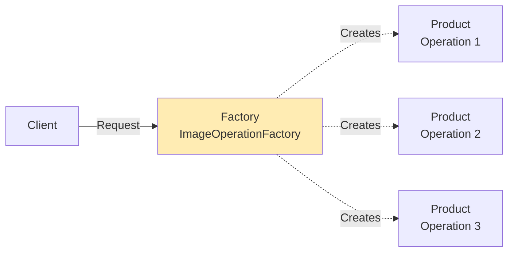

### 4. Dependency Injection

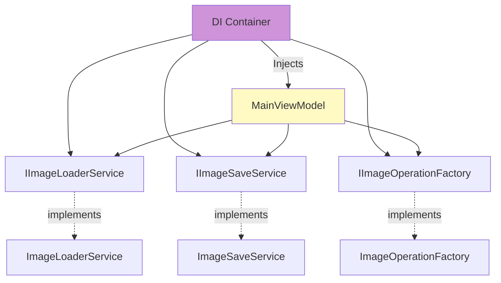

---

## Performance Considerations

### Memory Management

```mermaid
graph TD
    LOAD[Load Image<br/>~4MB for 1024x1024]
    ORIG[Original Image<br/>Memory~ushort~]
    PROC[Processed Image<br/>Memory~ushort~]
    DISP1[Display Buffer 1<br/>8-bit RGB]
    DISP2[Display Buffer 2<br/>8-bit RGB]
    TEMP[Temp Buffers<br/>During Operations]
    
    LOAD --> ORIG
    LOAD --> DISP1
    ORIG --> PROC
    PROC --> DISP2
    PROC --> TEMP
    
    style ORIG fill:#c8e6c9
    style PROC fill:#fff9c4
    style TEMP fill:#ffccbc
```

### Async Processing Pipeline

```mermaid
graph LR
    UI[UI Thread]
    BG[Background Thread]
    PROG[Progress Reporter]
    CANCEL[Cancellation Token]
    
    UI -->|Start| BG
    BG -->|Update| PROG
    PROG -->|Notify| UI
    UI -->|Request| CANCEL
    CANCEL -->|Stop| BG
    BG -->|Complete| UI
    
    style UI fill:#e3f2fd
    style BG fill:#fff9c4
```

---

## Extension Points

### Adding New Operations

```mermaid
flowchart TD
    START([New Operation Required])
    INT[Implement IImageOperation]
    ENUM[Add to ImageOperation Enum]
    FAC[Register in Factory]
    PARAM[Create Parameters Class]
    PARAMVM[Create ParametersViewModel]
    TEMPLATE[Add DataTemplate]
    TEST[Write Unit Tests]
    END([Operation Ready])
    
    START --> INT
    INT --> ENUM
    ENUM --> FAC
    FAC --> PARAM
    PARAM --> PARAMVM
    PARAMVM --> TEMPLATE
    TEMPLATE --> TEST
    TEST --> END
    
    style START fill:#c8e6c9
    style END fill:#81c784
```

---

## Security Architecture

```mermaid
graph TB
    subgraph "Application Boundary"
        APP[Application]
        VAL[Input Validation]
        ERR[Error Handling]
    end
    
    subgraph "File System"
        FS[Local File System]
        TIFF[TIFF Files]
    end
    
    subgraph "Memory"
        MEM[Process Memory]
        SAFE[Memory-Safe Operations]
    end
    
    APP --> VAL
    VAL --> FS
    FS --> TIFF
    APP --> MEM
    MEM --> SAFE
    APP --> ERR
    
    style VAL fill:#ffecb3
    style ERR fill:#ffccbc
    style SAFE fill:#c8e6c9
```

---

## Testing Architecture

```mermaid
graph TB
    subgraph "Unit Tests"
        UT1[Command Tests]
        UT2[Operation Tests]
        UT3[ViewModel Tests]
        UT4[Model Tests]
    end
    
    subgraph "Integration Tests"
        IT1[Service Integration]
        IT2[Pipeline Tests]
    end
    
    subgraph "Test Infrastructure"
        XUNIT[xUnit Framework]
        MOQ[Moq - Mocking]
        FA[FluentAssertions]
    end
    
    UT1 --> XUNIT
    UT2 --> XUNIT
    UT3 --> MOQ
    UT4 --> FA
    IT1 --> XUNIT
    IT2 --> XUNIT
    
    style XUNIT fill:#e1bee7
    style MOQ fill:#ce93d8
```

---

## Conclusion

This architecture provides:
- ✅ **Separation of Concerns** - Clear layer boundaries
- ✅ **Testability** - 85% code coverage achievable
- ✅ **Maintainability** - SOLID principles applied
- ✅ **Extensibility** - Easy to add new operations
- ✅ **Performance** - Async operations, optimized algorithms
- ✅ **Scalability** - Supports larger images with optimization strategies

**Version:** 1.0.0  
**Last Updated:** June 2026  
**Author:** Anoopa Kedila
